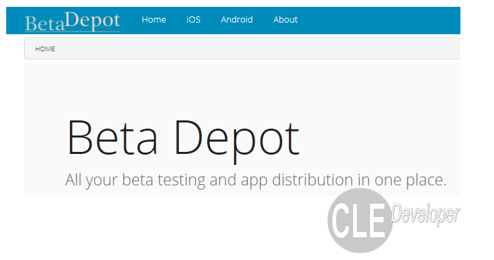

Iteedee.BetaDepot
=================

Mobile beta testing distribution application build on ASP.NET MVC. Free your self from getting kickoff of your current provider with Beta Depot.
***Give your organization complete control over your distribution and continuous integration with Beta Depot***

#  Cross Platform

**Beta Depot** focuses on the need to distribute your mobile apps across your team. It supports **iOS** and **Android** application builds. The application can be used from any device or computer with a modern browser.

#  Team Enabled

Team efforts require team-based tools. **Beta Depot** strives to make your team a first-class citizen.

Beta Depot provides the following functionality:

*   **User Profiles**: Every user will have their own account using [Gravitar][1] for the profile image.
*   **Team Membership**: Application administrators can define is team membership. It is as simple as entering the users email and selecting their assigned role.
*   **Team Roles**: Members can be assigned to application as *Administrators*, *Testers* and *Developers*. 

#  Target Multiple Environments

**Beta Depot** allows you to specify the environment your build is targeting. Whether your next build to upload is a production build or just another nightly development build, **Beta Depot** is specifically designed to organize all of your builds regardless of the target environment.

#  Manage Builds & History

**Beta Depot** will always maintain a history of builds uploaded. With regression testing a reality of the software landscape, allowing testers to install older version without making a request to the development team will empower QA members. **Beta Depot** will keep track of the following for each build uploaded:

*   Uploaded By User.
*   Date & Time Uploaded
*   Application Version Information
*   Environment Targeted
*   Build Notes Documented by Uploaded User.
*   Application Main Icon

#  Responsive Architecture

With the diverse device footprint that exists it is a must to implement responsive web architectures. **Beta Depot** supports browser displays **large** and **small**. Choose and install your **iOS** or **Android** build right from the browser.

> Beta Depot is currently in **Beta** (no pun intended, really). We are working hard to get it right. If you would like to get updates or see our progress please visit the [Beta Depot Project][2] page.

## MIT License

Permission is hereby granted, free of charge, to any person obtaining a copy
of this software and associated documentation files (the "Software"), to deal
in the Software without restriction, including without limitation the rights
to use, copy, modify, merge, publish, distribute, sublicense, and/or sell
copies of the Software, and to permit persons to whom the Software is
furnished to do so, subject to the following conditions:

The above copyright notice and this permission notice shall be included in
all copies or substantial portions of the Software.

THE SOFTWARE IS PROVIDED "AS IS", WITHOUT WARRANTY OF ANY KIND, EXPRESS OR
IMPLIED, INCLUDING BUT NOT LIMITED TO THE WARRANTIES OF MERCHANTABILITY,
FITNESS FOR A PARTICULAR PURPOSE AND NON-INFRINGEMENT. IN NO EVENT SHALL THE
AUTHORS OR COPYRIGHT HOLDERS BE LIABLE FOR ANY CLAIM, DAMAGES OR OTHER
LIABILITY, WHETHER IN AN ACTION OF CONTRACT, TORT OR OTHERWISE, ARISING FROM,
OUT OF OR IN CONNECTION WITH THE SOFTWARE OR THE USE OR OTHER DEALINGS IN
THE SOFTWARE.

 [1]: http://en.gravatar.com/
 [2]: http://blog.iteedee.com/projects/beta-depot/
